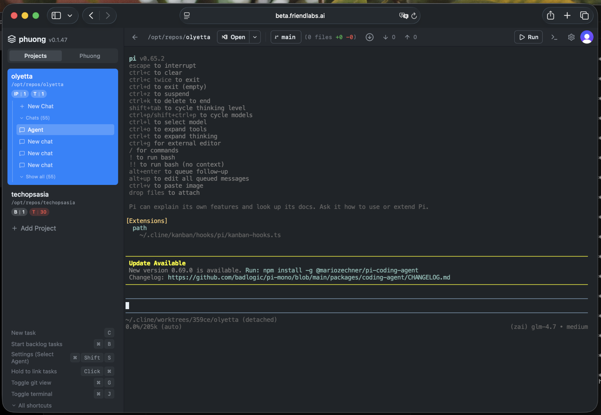

# Phuong

<p align="center">
  
</p>

Always-on AI project manager on your VPS, built on a [Kanban](https://github.com/cline/kanban) fork.

**Phuong** is the conduit: you talk to her from phone or desktop and she plans, routes Pi worker chats, verifies, and reports. **Dashboard** is optional — project/chat ledger for watching work and E2E artifacts without interjecting. Either entry is enough.

This stack is its own product/deploy — keep it isolated from any other agent systems.

## Status

Deployed on netcup VPS `159.195.213.113` (HTTP). See `docs/DEPLOY-HETZNER.md` (same Ansible flow; Terraform/Hetzner optional) and `docs/PHUONG-CONDUIT.md`.

## Dual entry

| Mode | Purpose |
|------|---------|
| **Phuong** (default home) | Talk only here. She creates project chats, picks models by tier (cheap vs strong), runs gates, attaches screenshots, reports back. |
| **Dashboard** | Browse projects → chats, watch Pi sessions read-only, view artifacts. Interject only if you unlock it. |

There is no kanban board UI. Board columns still back chat sessions internally. Next product shape (project tabs → outcomes → nested pi runs → DB trail) is in `docs/OUTCOME-HIERARCHY-PLAN.md`.

## Architecture

- **Kanban fork** — runtime, worktrees, agent sessions, git, tRPC
- **Phuong** — orchestrator (plan, route, verify, memory)
- **pi** — workers in worktrees; model per chat via tier (`T0`…`T3`)
- **Memory** — external git repo (`base-control`)
- **Auth** — Clerk
- **Deploy** — Hetzner VPS, nginx, TLS, systemd, Ansible/Terraform

### Worker chats

1. Phuong (or Dashboard “+ New Chat”) creates a task card
2. Runtime creates a git worktree
3. Pi starts with the chat’s model (`PHUONG_MODEL_T*`)
4. Terminal streams to the browser (watch-only by default)
5. Concurrent chats = concurrent PTYs/worktrees

## Model tiers (VPS env)

```bash
PHUONG_MODEL_T0=kimi-coding/kimi-k2.7   # light
PHUONG_MODEL_T1=kimi-coding/kimi-k2.7   # standard
PHUONG_MODEL_T2=kimi-coding/kimi-k3     # complex
PHUONG_MODEL_T3=kimi-coding/kimi-k3     # high-risk
KIMI_API_KEY=...
DEFAULT_MODEL=...   # Phuong's own model
```

## Docs

| Document | Purpose |
|----------|---------|
| `docs/PHUONG-CONDUIT.md` | Product model: conduit + optional dashboard |
| `docs/OUTCOME-HIERARCHY-PLAN.md` | Next design: tabs, outcomes, nested pi runs, DB trail |
| `docs/CRUSH-VISUAL-STEAL-PLAN.md` | Crush look in React (no Crush runtime) |
| `docs/OUTCOME-CRUSH-RUNSHEET.md` | Execution order for the two plans above |
| `docs/DEPLOY-HETZNER.md` | New Hetzner VPS deploy (reuse keys) |
| `docs/HERMES-FRONT-END.md` | Hermes talk layer + `phuong-ctl` bridge |
| `docs/BUILD-RUNSHEET.md` | Historical build phases (1–7) |
| `docs/PHUONG-ORCHESTRATE-ADOPTION-PLAN.md` | Orchestration protocol |
| `docs/KANBAN-FULL-BUILD-PLAN.md` | Full architectural plan (superseded product shape) |
| `docs/MEMORY-SEPARATION.md` | External memory repo |
| `docs/ARCHITECTURE.md` | v1 (historical) |
| `kanban/docs/architecture.md` | Kanban runtime architecture |

## Deploy (new Hetzner box)

```bash
cd deploy
# terraform.tfvars: use_existing_ssh_key or friendlabs-deploy key
./deploy.sh terraform-apply
# configure .env (Clerk, KIMI, PHUONG_MODEL_T*)
./deploy.sh kanban
```

Details: `docs/DEPLOY-HETZNER.md`.

## Updating upstream

This repo stays updateable with upstream Kanban, `pi`, and Cline packages. See prior notes in git history and `kanban/AGENTS.md` for fork seams.
